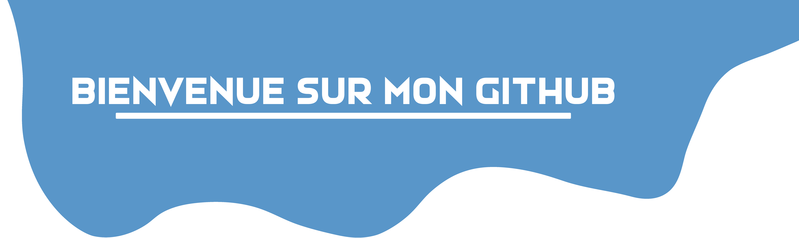

# 
Salut, moi c'est Anthony :smiley:

<h3>Qui suis-je</h3>

Étudiant en LP Développement d'Application Web et Big Data, j'adore faire du developpement web avec toutes sortes de nouvelles technologies. :grin:

### 
Langages connus

    
    
    <!---->
    <!---->
    
    
    
    
    <!---->

### 
Outils utilisés

    
    
    
    
    
    
    
    
    
    

### 
Quelques statistiques :yum:

      
    

### 
Pour me contacter

    
    
    <a href="mailto:anthony.audoin@etu.unilim.fr">

